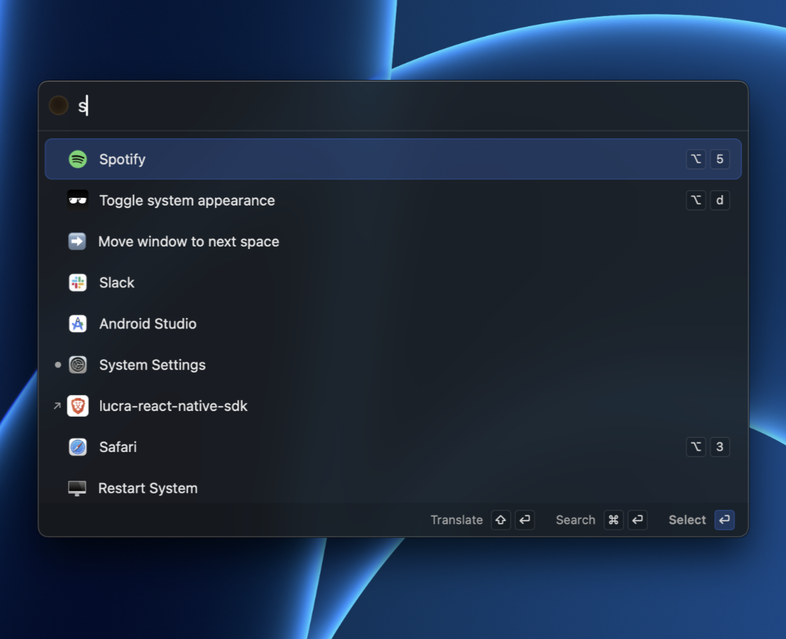

# typelessOS
Effortless MacOS Experience



## Architecture & Site Map

typelessOS is designed as a multi-layered macOS application where different windows interact to provide a seamless AI and terminal experience.

### Window Hierarchy & Interactions

- **Status Bar Item**: The main entry point. Clicking the icon in the macOS menu bar toggles the visibility of the **Chat Panel**.
- **Chat Panel**: The primary interface. From here you can:
    - Chat with AI providers (Gemini, Groq, etc.).
    - View and manage Chat History.
    - Trigger Terminal Commands via AI tool calls.
    - Open the **Settings Window** for configuration.
- **Terminal Output Block**: Appears within the Chat Panel when a command is executed.
    - **Yellow Button**: Minimizes the output into a **Terminal Bubble** that floats on the screen, keeping the command running in the background while freeing up chat space.
    - **Green Button**: Explodes the output into a **Full Interactive Terminal Window** for deep interaction.
    - **Red Button**: Sends a `Ctrl+C` signal to terminate the running process.
- **Terminal Bubble**: A compact, draggable indicator of a background process. Clicking it restores the output back into the Chat Panel.
- **Full Interactive Terminal Window**: A standalone window that provides a real PTY interface for the running session. Closing this window or using the red button stops the command.
- **Floating Island**: A persistent overlay at the bottom of the screen that provides status updates for voice recording and system state.

### Interactions Flow
1. **User** -> **Status Bar** -> Opens **Chat Panel**.
2. **Chat Panel** -> **AI** -> Generates Shell Command.
3. **User** -> Executes Command -> Shows **Terminal Output Block**.
4. **Terminal Output Block** -> **Green Button** -> Shows **Full Terminal Window**.
5. **Terminal Output Block** -> **Yellow Button** -> Shows **Terminal Bubble**.

---

## Setup & Running

### 1. Terminal Server (MCP)
The application requires the `McpTerminalServer` to be running to execute commands.

```bash
cd McpTerminalServer
yarn build
yarn start --port 8002
```

### 2. Main Application
Build and run the Xcode project:

```bash
# Build and run (Release)
xcodebuild -project TypelessOS.xcodeproj -scheme TypelessOS -configuration Release build && \
killall TypelessOS 2>/dev/null; \
sleep 1; \
open ~/Library/Developer/Xcode/DerivedData/TypelessOS-*/Build/Products/Release/TypelessOS.app

# Build and run (Debug)
xcodebuild -project TypelessOS.xcodeproj -scheme TypelessOS -configuration Debug build && \
open ~/Library/Developer/Xcode/DerivedData/TypelessOS-*/Build/Products/Debug/TypelessOS.app

# Open without recompiling (Debug)
open ~/Library/Developer/Xcode/DerivedData/TypelessOS-*/Build/Products/Debug/TypelessOS.app

# Open without recompiling (Release)
open ~/Library/Developer/Xcode/DerivedData/TypelessOS-*/Build/Products/Release/TypelessOS.app
```

### MCP Browser Server

Chrome Dev
```bash
"/Applications/Google Chrome.app/Contents/MacOS/Google Chrome" \
  --remote-debugging-port=9222 \
  --user-data-dir="/tmp/chrome_dev_profile"
```

Playwright MCP Server
```bash
npx -y @playwright/mcp@latest --port 8931 --cdp-endpoint http://localhost:9222

```

## Shoutouts
- [whisper.cpp](https://github.com/ggerganov/whisper.cpp)
- [MCP Protocol](https://modelcontextprotocol.io/)


```
https://github.com/ospfranco/sol?tab=readme-ov-file
```